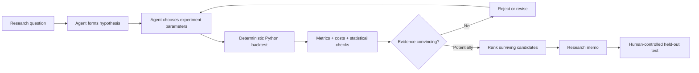
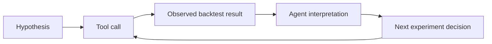
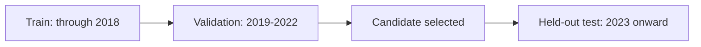

# Alpha Research Agent

An LLM-driven quantitative research agent that turns a plain-English momentum question into a small, auditable sequence of backtests, critiques the results, and produces a research memo - while keeping the final test period sealed until a human explicitly opens it.

> **Status:** educational/research prototype. It is designed to demonstrate agent architecture and quantitative research hygiene, not to provide investment advice or production trading signals.

## What it does end to end



A typical prompt is:

> Find a simple, robust cross-sectional momentum signal in the available sector ETF universe. Account for transaction costs and do not inspect the held-out test period.

The language model is the **research manager**: it decides what experiment to run next based on previous results. It is **not** the numerical backtester. Fixed Python functions calculate signals, portfolio returns, costs, turnover, drawdowns, Sharpe ratios, and statistical diagnostics.

## Data sources, tools, and outputs

| Layer | Current implementation |
| --- | --- |
| Market data | Yahoo Finance via `yfinance` |
| Universe | 9 long-history U.S. sector ETFs: `XLB XLE XLF XLI XLK XLP XLU XLV XLY` |
| Frequency | Daily adjusted market prices |
| Agent framework | OpenAI Agents SDK (`Agent`, `Runner`, function tools) |
| Quant stack | `pandas`, `numpy`, `scipy` |
| Agent tools | `describe_dataset`, `run_momentum_experiment`, `list_experiments` |
| HTTP API | FastAPI service in `api.py` with interactive Swagger docs at `/docs` |
| Experiment memory | Local JSONL experiment log |
| Main output | Research memo saved to `results/latest_memo.md` and timestamped memo files |
| Final test | Separate `finalize.py` command; never exposed as an agent tool |
| Tests | Synthetic-data `pytest` suite + GitHub Actions workflow |

### Outputs created locally

After a run, the project can create:

```text
data/adjusted_close.csv
results/experiments.jsonl
results/latest_memo.md
results/memos/memo_<timestamp>.md
```

These research outputs and downloaded data are intentionally ignored by Git so that local experiment history is not accidentally committed.

## The research idea: cross-sectional momentum

For asset `i` at date `t`, the signal is

```text
momentum(i,t) = P(i,t-skip) / P(i,t-lookback) - 1
```

For example, `lookback_days=252` and `skip_days=21` approximates a 12-month momentum signal that excludes the most recent month (often called a 12-1 style construction).

At each rebalance date, the strategy:

1. ranks the ETFs by the momentum signal;
2. goes long the strongest group;
3. goes short the weakest group;
4. scales the long book to `+0.5` and the short book to `-0.5`;
5. optionally uses inverse-volatility weighting; and
6. subtracts turnover-based transaction costs.

The portfolio is therefore designed to be approximately dollar-neutral with gross exposure 1.

## Why this is an agent rather than an LLM wrapper

A one-shot LLM wrapper would receive a question and return text or code. This project uses a feedback loop:



The next action depends on the result of the previous action. The project also has persistent experiment records, a hard experiment budget, and explicit stopping/rejection rules.

## Research controls

### 1. Sealed test set



The research agent can inspect **training and validation only**. `finalize.py` is intentionally not an agent tool. This reduces the risk of turning the test set into another tuning set.

### 2. Look-ahead protection

Weights formed using information at close `t` are shifted before calculating strategy returns, so they can only earn the return from `t` to `t+1`.

### 3. Transaction costs

Turnover is estimated from portfolio weight changes. Costs are charged in basis points and deducted from gross returns. The report shows both gross and net metrics plus annualized cost drag.

### 4. Experiment budget

The code enforces a maximum of eight momentum experiments per agent run. This is deliberately restrictive: an autonomous system that keeps searching until it finds a high Sharpe ratio is simply automating p-hacking.

### 5. More robust inference

The backtester reports both:

- the usual IID t-statistic for the daily mean return; and
- a Bartlett-kernel HAC/Newey-West-style t-statistic that allows for short-range serial dependence and heteroskedasticity.

The HAC statistic is still **not** a cure for multiple testing, selection bias, nonstationarity, or a small investment universe. The agent is explicitly instructed to acknowledge those limitations.

## Repository structure

```text
alpha-research-agent/
├── agent.py                  # Agent instructions and tools
├── backtest.py               # Signals, portfolios, costs, statistics
├── config.py                 # Universe and research split
├── data.py                   # Yahoo Finance download/cache/validation
├── finalize.py               # Human-controlled held-out evaluation
├── api.py                    # FastAPI HTTP interface (test set intentionally excluded)
├── research_store.py         # Experiment log + saved memos
├── run.py                    # CLI entry point
├── requirements.txt
├── pyproject.toml            # FastAPI entry point (`api:app`)
├── requirements-dev.txt
├── .env.example
├── .gitignore
├── LICENSE
├── tests/
│   ├── test_backtest.py
│   └── test_api.py
├── docs/
│   ├── GITHUB_SETUP.md
│   ├── alpha_research_agent_guide.pdf
│   └── images/
└── .github/workflows/tests.yml
```

## Setup

Requires Python 3.10+ (Python 3.11 is a good choice).

### 1. Clone and enter the repository

```bash
git clone https://github.com/<YOUR-USERNAME>/alpha-research-agent.git
cd alpha-research-agent
```

If you are running the downloaded folder before publishing it, simply `cd` into that folder instead.

### 2. Create a virtual environment

macOS/Linux:

```bash
python3 -m venv .venv
source .venv/bin/activate
```

Windows PowerShell:

```powershell
python -m venv .venv
.venv\Scripts\Activate.ps1
```

### 3. Install dependencies

```bash
pip install -r requirements.txt
```

For development/testing:

```bash
pip install -r requirements-dev.txt
```

### 4. Configure the API key

Recommended:

```bash
cp .env.example .env
```

Edit `.env` and replace the placeholder with your OpenAI API key.

**Never commit `.env` or paste a real API key into source code.** The repository's `.gitignore` already excludes it.

The model is intentionally not hard-coded. If `AGENT_MODEL` is unset, the OpenAI Agents SDK selects its default model. To choose one explicitly, set `AGENT_MODEL` in `.env` or pass `--model` on the command line.

## Run the agent

### Default research question

```bash
python run.py --reset
```

On first use, the project downloads and caches the ETF data. The agent then runs a controlled research loop and prints its final memo. The memo is also saved under `results/`.

### Custom research question

```bash
python run.py --reset --question \
"Investigate whether 6-to-12 month cross-sectional momentum survives a one-month skip and monthly rebalancing."
```

### Force a fresh Yahoo Finance download

```bash
python run.py --reset --refresh-data
```

### Choose a model explicitly

```bash
python run.py --reset --model gpt-5.6-sol
```

Model availability can change; use a model available to your OpenAI API account.

## Run it as a FastAPI service

The same research engine can also be launched as an HTTP API. This is useful if you want to connect the agent to a web frontend, another application, a notebook, or a remote client.

The API deliberately exposes **research and inspection endpoints only**. It does **not** expose the held-out test set. Final test evaluation remains a separate human-controlled CLI step through `finalize.py`.

### Start the development server

After installing `requirements.txt` and configuring `.env`, run:

```bash
fastapi dev
```

The repo includes a `pyproject.toml` entry point, so FastAPI knows that the application is `api:app`.

Then open:

- API root: `http://127.0.0.1:8000/`
- Interactive Swagger documentation: `http://127.0.0.1:8000/docs`
- Alternative ReDoc documentation: `http://127.0.0.1:8000/redoc`

FastAPI automatically generates the interactive documentation from the endpoint and Pydantic schemas.

### API endpoints

| Method | Endpoint | Purpose |
| --- | --- | --- |
| `GET` | `/` | Basic service information and links |
| `GET` | `/health` | Check that the API process is alive |
| `GET` | `/dataset` | Inspect the available market dataset and research split |
| `GET` | `/experiments` | Read the local experiment history |
| `POST` | `/research` | Run an agent research session and return the final memo |

There is intentionally **no `/finalize` endpoint**. This makes it harder for an automated client to repeatedly query the held-out test period during strategy selection.

### Example request

With the server running, you can call the research endpoint from another terminal:

```bash
curl -X POST "http://127.0.0.1:8000/research" \
  -H "Content-Type: application/json" \
  -d '{
    "question": "Investigate whether medium-horizon cross-sectional momentum survives a one-month skip and monthly rebalancing.",
    "reset": true,
    "refresh_data": false
  }'
```

Or simply use the **Try it out** button at `http://127.0.0.1:8000/docs`.

### Current API behavior

Research runs are serialized with a process-level lock so two simultaneous `/research` requests cannot interleave writes to the local experiment store. This is appropriate for the current single-user prototype. A production service would eventually replace the JSONL store and process-local lock with a database, job queue, authentication, rate limits, and asynchronous/background job handling.

## Open the held-out test only after selecting a candidate

Suppose the research memo selects experiment 3. Then run:

```bash
python finalize.py 3
```

This prints training, validation, and held-out test results for that already-selected specification.

Do not use the test result to keep selecting new variants and still call it a held-out test.

## Run the test suite

The tests use synthetic prices, so they do not need an API key or live market data.

```bash
pytest -q
```

They currently check important invariants such as:

- momentum signals only reference past prices;
- invested portfolios are dollar-neutral with gross exposure 1;
- transaction costs cannot improve net returns; and
- a newly formed position cannot capture the same day's return.

GitHub Actions runs these tests automatically on pushes and pull requests. The repository also includes API tests for `/health` and a mocked `/research` request; those require the normal development dependencies to be installed.

## What was improved in this version

Compared with the initial prototype, this release adds:

- a public, end-to-end README;
- current OpenAI Agents SDK usage without a hard-coded default model;
- a hard per-run experiment budget enforced in code, not only in the prompt;
- cached-data validation;
- gross **and** net performance reporting;
- explicit annualized transaction-cost drag;
- HAC/Newey-West-style t-statistics in addition to naive IID inference;
- persistent Markdown research memos;
- `.env.example` and safer secret handling;
- `.gitignore` for local data, keys, and experiment artifacts;
- synthetic-data unit tests;
- GitHub Actions continuous integration;
- a FastAPI HTTP layer with automatically generated interactive API documentation;
- API-level tests for the health and research endpoints;
- a `pyproject.toml` FastAPI entry point so the service can be launched with `fastapi dev`;
- a public PDF guide and GitHub publishing instructions.

## What I would add next - and what I would not add yet

The best next additions are research-quality improvements, not more agent complexity.

**High priority:**

1. walk-forward or rolling validation rather than one fixed validation window;
2. richer robustness plots and year-by-year performance decomposition;
3. persistent API jobs/status endpoints for longer research runs;
4. factor/beta/sector neutralization tools;
5. a point-in-time equity universe with delisted names and realistic liquidity filters;
6. formal multiple-testing controls or a pre-registered experiment family;
7. borrow fees, spread/market-impact assumptions, and execution timing refinements.

**Later:**

- a second “quant critic” agent;
- literature retrieval and paper comparison;
- additional alpha families such as mean reversion, value, quality, or volatility;
- a dashboard or web frontend that consumes the FastAPI service;
- database-backed experiment tracking.

I would **not** add those immediately. The current single-agent design is easier to audit and is a better learning project. A multi-agent system is useful only after the deterministic research layer is trustworthy.

## Important limitations

- Yahoo Finance is convenient for an educational prototype, not institutional-grade market data.
- The ETF universe is tiny, which limits cross-sectional statistical power.
- Historical performance does not establish future profitability.
- The transaction-cost model is simplified.
- The strategy does not currently model short-borrow constraints, market impact, taxes, or execution slippage beyond a simple cost assumption.
- The fixed universe avoids some stock-level survivorship issues but is not a substitute for a true point-in-time security master.
- Repeated human reruns with different prompts can still create selection bias even if each individual run has an experiment cap.

## Framework

The project uses the **OpenAI Agents SDK** for agent orchestration. The SDK manages the loop in which the model chooses a tool, receives the result, and decides what to do next. The quantitative calculations themselves remain ordinary deterministic Python.

## License

MIT. See [`LICENSE`](LICENSE).

## Publishing to GitHub

See [`docs/GITHUB_SETUP.md`](docs/GITHUB_SETUP.md) for step-by-step commands to create a GitHub repository, initialize Git locally, push the project, protect your API key, and choose useful repository topics.
